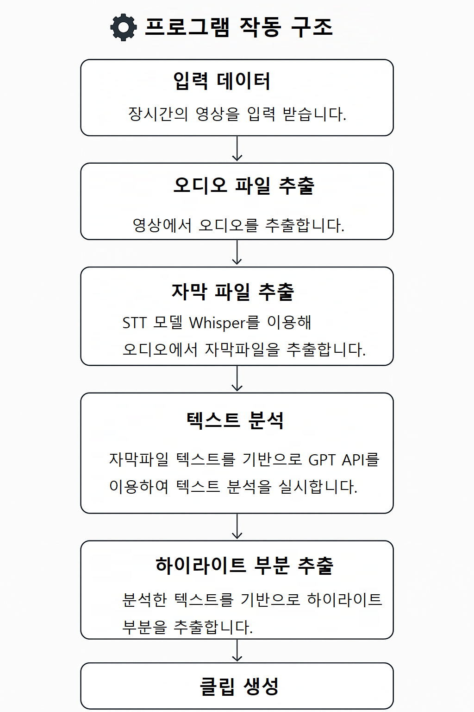
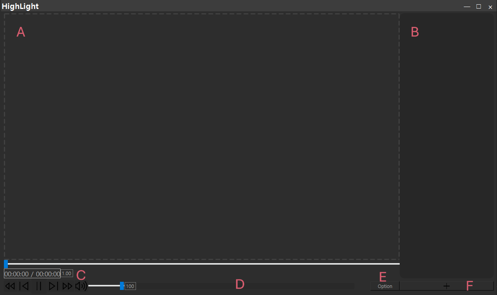
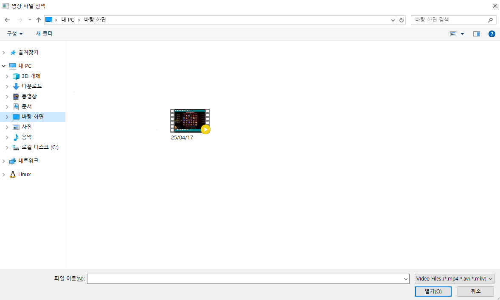
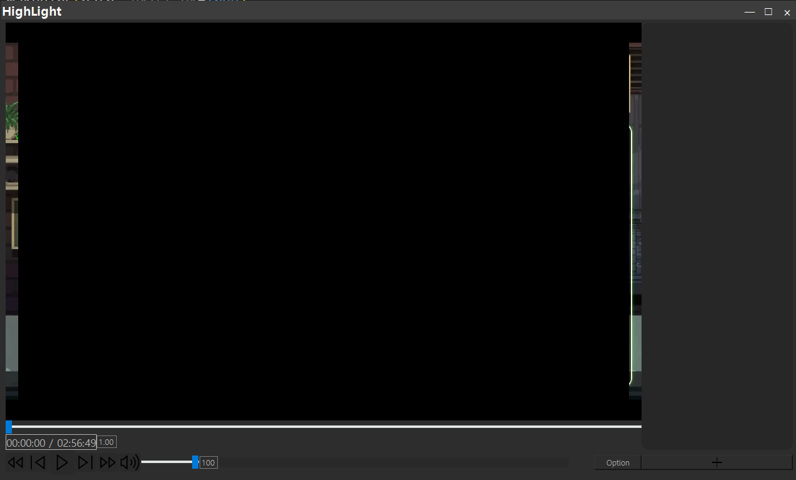
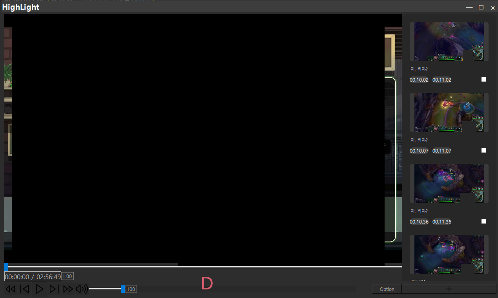
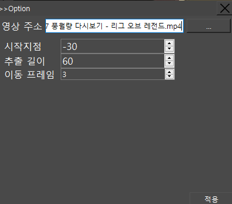
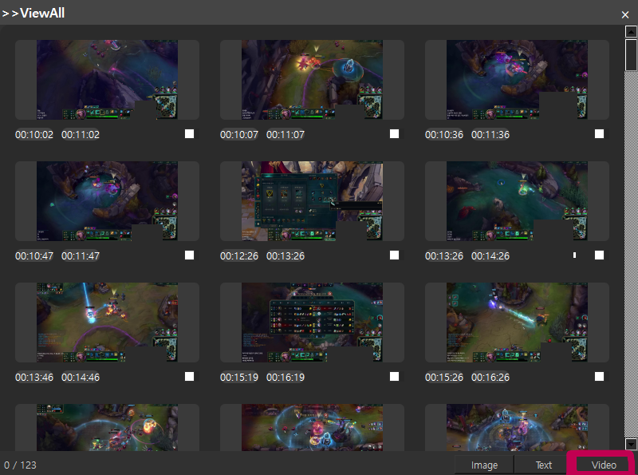
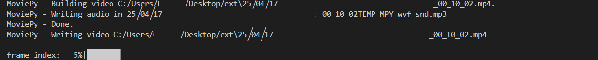

# 🎥하이라이트 추출 프로그램 소개

이 프로그램은 **오디오가 포함된 특정한** 영상에서 잘 작동합니다.
동영상 내 주요 하이라이트 구간을 자동으로 판단하고, 해당 구간을 기반으로 클립을 생성해 줍니다.
다음 영상을 생각하고 만들었습니다.
 1. **장시간의 동영상** (1시간 이상)
 2. **인터넷 방송인**이 플레이하는 게임 동영상
 3. 플레이하는 게임이 **플레이어와 전투가 일어나는 게임.** (ex AOS, FPS 게임)

**오디오 기반**으로 동영상 하이라이트를 판단하고 있습니다.

<br>

## 📝 목차 
---
1. [**팀원**](#-팀원)
2. [**프로젝트 개요**](#-프로젝트-개요)
3. [**기술 스택**](#-기술-스택)
4. [**프로그램 작동 구조**](#%EF%B8%8F-프로그램-작동-구조-및-설명)
5. [**주요 기능**](#%EF%B8%8F-주요-기능)
6. [**프로젝트 구조**](#-프로젝트-구조)
7. [**설치 방법**](#-설치-방법)
8. [**프로그램 화면**](#%EF%B8%8F-프로그램-화면)
9. [**프로젝트 소감**](#-프로젝트-소감)
   <br><br><br>

---
## 👨‍💻 팀원

| 이름   | 학번      | 역할             | 담당 업무                        |
|--------|-----------|------------------|----------------------------------|
| [**나민수**](https://github.com/Hoppouu) | 20203255 | 💼 Project Leader, Backend| 프로그램 전반 기획 및 설계, 백엔드 기능 개발|
| [**백승렬**](https://github.com/BulPa) | 20203237 | 🎨 Frontend      | 전체 GUI 구성 및 프론트엔드 아키텍처 개발|
| [**박원빈**](https://github.com/wonbinnim) | 20203253 | 🎨 Frontend      | UI 디자인 및 화면 구성 요소 개발|
| **김형우** | 20181584 | 💻 Backend       | text_divide 함수 구현|
| **채지민** | 20213037 |         |   |

<br><br><br>

---
## 📖 프로젝트 개요
최근 인터넷 방송 산업이 폭발적인 성장세를 보이며, 트위치·유튜브 등을 중심으로 다양한 1인 미디어 콘텐츠가 제작되고 있습니다. 이에 따라 방송 VOD를 클립 형식으로 편집해 하이라이트 영상으로 재가공하는 수요도 증가하고 있으며, 영상 편집 작업의 자동화에 대한 관심도 높아지고 있습니다.<br>

본 프로젝트는 이러한 흐름에 맞춰, **오디오가 포함된 게임방송 및 인터넷 방송 영상에 한해** 음성 인식 기반 하이라이트 추출 기능을 제공하는 데스크탑 응용프로그램입니다.<br>
영상 속 음성을 텍스트로 전환한 뒤, 의미 있는 발화나 감정 표현이 포함된 구간을 자동으로 감지하여 하이라이트 후보를 제시합니다.<br>
동영상에서 음성만을 추출하여 하이라이트 후보를 정하기 때문에 영상 정보를 이용하는 것보다 훨씬 빠르게 찾을 수 있을 것입니다.
<br><br><br>

---
## 🧱 기술 스택

|    🏷️ 분류   | 🛠️ 내용                                                                        |
| :--------- | :---------------------------------------------------------------------------- |
|    💻 언어    | Python                                                                        |
| 📚 주요 라이브러리 | PyQt5 (GUI), OpenCV (영상 처리), ffmpeg-python (썸네일 추출), Whisper (음성 인식), numpy 등 |
|    🎨 UI    | Qt Designer, PyQt5                                                            |
|  💾 데이터 저장  | JSON 파일 기반                                                                    |
| ☁️ AI / API | Whisper (음성 인식), OpenAI GPT API (LLM 활용)                                      |
|  🖥️ 지원 OS  | Windows                                                                       |

<br><br><br>

---
## ⚙️ 프로그램 작동 구조 및 설명

<br>
대략적인 흐름은 위 이미지와 같습니다.

우리는 주로 결정하는 모델이 LLM입니다. LLM은 최대 토큰 수가 있습니다. 우리 프로젝트는 장시간의 동영상의 자막파일을 추출하기 때문에 텍스트량이 많습니다.
이를 해결하기 위해 슬라이딩 윈도우 방식으로 자막파일을 슬라이싱하여 LLM에 넘겨주는 방식을 사용했습니다.

LLM을 사용하면서 큰 문제점이 되는 것은 Hallucination입니다. 이 문제를 해결하기 위해서 다음과 같은 방법을 사용했습니다.
 1. 생각의 사슬(Chain of Thought Prompting)을 통해 LLM이 단계적으로 추론하도록 했습니다. 단계적 추론은 Hallucination 감소 효과가 있습니다.
 2. 자기 교차검증(Self-Consistency) 입니다. 슬라이딩 윈도우 방식을 사용할 때 자막 파일이 앞뒤로 조금씩 겹치게 하여 LLM에 넘겼습니다. 겹치는 구간에서 나온 일관된 결과들은 신뢰도가 높을 것입니다.
    - 슬라이딩 윈도우 방식을 할 때 겹치는 방식은 [0-100], [50–150], [100–200]와 같은 일정한 간격 입니다.
 3. 정합성 검사(Consistency Checking) 입니다. LLM에서 나온 출력을 원본 자막파일과 비교해서 실제로 존재하는 자막 내용인지, 실제로 존재하는 타임 스탬프인지 확인하였습니다.

위 와같은 방법은 [TimeChat: A Time-sensitive Multimodal Large Language Model for Long Video Understanding](https://github.com/RenShuhuai-Andy/TimeChat)을 참고하여 우리 프로젝트에 맞게 변형 해보았습니다.
<br><br><br>

## 🛠️ 주요 기능
- 🎥 동영상에서 하이라이트 구간 자동 추출
- 📝 음성 및 자막 분석을 통한 주요 장면 식별
- 🖼️ 하이라이트 구간별 썸네일 자동 생성
- ⏱️ 타임라인 기반 하이라이트 구간 시각화
- 🗂️ 추출된 하이라이트 클립 개별 저장 및 관리
- 🔗 외부 API 연동(예: 자막 변환, AI 분석 등)
- 🖱️ 직관적인 UI로 하이라이트 구간 확인
- 📊 JSON 기반 하이라이트 데이터 저장/불러오기

<br><br><br>

---
## 📁 프로젝트 구조

```
📁 Video_Highlight_Extractor
│
├── 📄 main.py                           # 프로그램 실행 시작점
├── 📄 requirements.txt                  # 프로젝트에 필요한 Python 패키지 목록
├── 📁 modules                              # 주요 기능 모듈
│   ├── 📄 api_call.py                      # 외부 API 호출 및 데이터 관리
│   ├── 📄 assemble.py                      # 각 모듈을 모아서 호출
│   ├── 📄 audio_energy_analysis.py         # 오디오 분석
│   ├── 📄 constants.py                     # 상수 값 정의
│   ├── 📄 extractor_url.py                 # url을 통한 영상 다운로드 모듈
│   ├── 📄 sound_to_text.py                 # 자막 추출 모듈
│   ├── 📄 text_divide.py                   # 텍스트를 토큰 사이즈에 맞게 분할 하는 모듈
│   ├── 📄 ui.py                            # ui 관련 파일
│   ├── 📄 utils.py                         # 공통으로 쓰이는 유틸리티 함수
│   └── ...
│   └── 📁 uifiles                          # UI 관련 리소스
│       ├── 📄 Clip_list.ui
│       ├── 📄 clip_maker.py
│       ├── 📄 ClipWidget.py
│       ├── 📄 dragger.py
│       └── ...
```
<br><br><br>

---
## 💻 설치 방법
- **Python 3.11**에서 동작합니다.
  - 설치가 필요하다면, [Python 공식 사이트](https://www.python.org/)에서 다운로드하세요.
  - 운영체제에 맞는 설치 파일을 선택해 설치를 진행합니다.
- Git이 설치되어 있어야 합니다.
  - 설치가 필요하다면, [Git 공식 사이트](https://git-scm.com/downloads)에서 다운로드하세요.
<br>

### 윈도우 기준 설치 및 실행 방법 (CMD 창)

CMD 창을 열고 아래 명령어들을 순서대로 실행하세요

#### 1. 레포지토리 클론
```cmd
git clone https://git.chosun.ac.kr/iap1-2025/class-06/team-01.git
cd team-01
```
<br>

#### 2. 가상환경 생성 및 활성화
```cmd
python -m venv venv
venv\Scripts\activate.bat
```
<br>

#### 3. 패키지 설치
##### 1) GPU 사용 가능한 경우 (NVIDIA 그래픽카드 및 CUDA 지원)
1. 그래픽카드 정보 확인  
   - `윈도우키 + R` → `dxdiag` 입력 → 디스플레이 탭에서 그래픽카드 정보 확인

2. [GPU Compute Capability 확인](https://developer.nvidia.com/cuda-gpus)  
   - 내 그래픽카드 모델에 맞는 Compute Capability 확인  
   - 만약 모델이 없으면, 페이지 상단의 **Legacy CUDA GPU Compute Capability**를 참고

3. [CUDA 지원 버전 확인](https://en.wikipedia.org/wiki/CUDA#GPUs_supported)  
   - Compute Capability에 맞는 CUDA 버전을 확인

4. [PyTorch 공식 설치 페이지](https://pytorch.org/get-started/locally/)  
   - Compute Platform을 CUDA 버전에 맞게 선택
5. 패키지 설치 (예: CUDA 12.6 지원 버전)
```cmd
pip3 install torch torchvision torchaudio --index-url https://download.pytorch.org/whl/cu126
pip install -r requirements.txt
```
##### 2) CPU만 사용 가능한 경우
```cmd
pip install -r requirements.txt
```
<br>

#### 4. GPU 툴킷 설치 (GPU 사용 시)

- [CUDA Toolkit 아카이브](https://developer.nvidia.com/cuda-toolkit-archive)에서  
  본인의 CUDA 버전에 맞는 Toolkit을 다운로드하여 설치하세요.
<br>

#### 5.API 키 발급 및 환경 변수 설정
1. [OpenAI](https://platform.openai.com/)에 접속하여 회원가입 또는 로그인 후 API 키를 발급받으세요.

2. 프로젝트 루트 디렉터리에 `.env` 파일을 생성합니다.

3. `.env` 파일에 아래 내용을 추가하세요:

```.env
OPENAI_API_KEY=[발급받은 API 키를 여기에 붙여넣기]
```
<br>

#### 6. 실행 방법
프로젝트 루트 디렉토리에서 아래 명령어로 실행하세요
```cmd
python main.py
```
<br><br><br>

## 🖥️ 프로그램 화면
### 메인 화면

- A 공간은 동영상이 보여지는 공간입니다. A 공간을 클릭하여 동영상을 불러올 수 있습니다.<br>
- B 공간은 추출된 영상 클립이 보여지는 공간입니다.<br>
- C 공간은 동영상 상태를 조작할 수 있습니다. 재생 정지, 소리 조절 등의 기능을 수행할 수 있습니다.<br>
- D 공간은 버튼입니다. A 공간을 눌러서 동영상을 로드 한 뒤 D 공간을 눌러서 비디오 하이라이트 추출을 시작합니다. (시간이 많이 소요됩니다.)<br>
- E 공간은 Option 입니다. 눌러서 OFFSET, 동영상 재지정을 수행할 수 있습니다.<br>
- F 공간은 클립 리스트 입니다. 새로운 창이 띄워지며 많은 클립을 한눈에 볼 수 있습니다.<br>
<br><br>

#### A 공간 클릭 시

 - 영상 파일을 선택할 수 있는 디렉토리가 켜집니다.
<br>
<br>


 - 영상 파일을 불러오고 난 뒤의 모습입니다.(동영상 화면은 자체적으로 가렸습니다. 원래는 정상적으로 보입니다)
<br>
<br>

#### B 공간

 - D 버튼을 눌러서 추출하게 되면 이와 같이 오른쪽에 클립 리스트가 생성됩니다.
<br>
<br>

#### E 공간

 - 영상 주소 탭을 눌러서 다른 영상을 불러오도록 할 수 있습니다.<br>
 - E 버튼을 누를 시 위와 같은 화면이 뜹니다. 시작 지점, 추출 길이 오프셋을 정할 수 있으며 동영상을 움직일 때 이동 할 프레임을 설정 할 수 있습니다.
<br>
<br>

#### F 공간

 - F 버튼을 누를 시 위와 같은 클립리스트가 팝업 됩니다.<br>
 - 원하는 클립을 체크박스를 통해 선택할 수 있습니다.<br>
 - 그 후 오른쪽 하단의 Video 버튼을 눌러서 다운로드를 진행합니다.<br>
<br>
<br>


 - 다운로드가 되고 있는 모습
<br>
<br>

#### 작동 방법
   1. A 공간으로 동영상 파일을 선택
   2. D 공간 버튼을 눌러서 동영상 파일을 추출
   3. B 공간을 이용하거나 F 공간을 이용해서 원하는 클립에 체크박스 체크.
   4. F 공간의 클립 리스트 창의 Video를 눌러 동영상 추출

